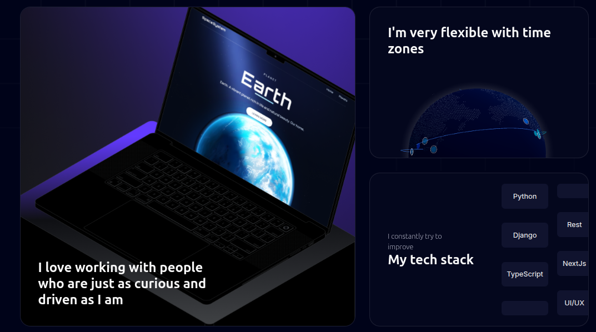

# Portfolio Website

This is a **personal portfolio website** built using [Next.js](https://nextjs.org/) and deployed at
🌐 **[keshavportfoliojs.netlify.app](https://keshavportfoliojs.netlify.app/)**

It showcases my projects, skills, and professional background in a clean and responsive layout, using modern frontend technologies and UI components.



---

## 🚀 Tech Stack

* **Framework**: [Next.js](https://nextjs.org/) – React framework for fast and SEO-friendly web apps.
* **Styling & UI**: Built with [Acertinity](https://acertinity.com/) libraries for a polished and consistent user interface.
* **Font Optimization**: Utilizes [`next/font`](https://nextjs.org/docs/basic-features/font-optimization) for loading Google Fonts efficiently.
* **Deployment**: Hosted on [Netlify](https://netlify.com).

---

## 🛠️ Getting Started (Development)

To run the project locally:

```bash
npm run dev
# or
yarn dev
# or
pnpm dev
# or
bun dev
```

Then, open [http://localhost:3000](http://localhost:3000) in your browser to view the site.

You can begin editing the homepage by modifying `app/page.tsx`. Changes reflect instantly during development.

---

## 📚 Learn More

* [Next.js Documentation](https://nextjs.org/docs) – Learn more about Next.js features and APIs.
* [Next.js Learn](https://nextjs.org/learn) – Interactive learning platform for mastering Next.js.
* [Next.js GitHub](https://github.com/vercel/next.js) – Community, issues, and contributions.

---

## 🚀 Deployment

This project is deployed on **Netlify** for fast global delivery.
You can explore deployment options in the official [Next.js deployment guide](https://nextjs.org/docs/deployment).

---
